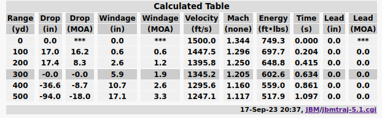

traject-rs
===

Mostly just porting the GPL'd JBM libraries to Rust.

## Accuracy

This library may occasionally provide decent results (see example below).

There may also occasionally be eggregious mathematical errors that cause you to shoot yourself in the foot (literally).

Use with caution and at your own risk.

## Sample

### JBM web v5.1 vs `examples/simple`

https://www.jbmballistics.com/cgi-bin/jbmtraj-5.1.cgi

---

`#! target/debug/examples/simple`

| Range | Drop | Velocity | Energy | Time |
| ----- | ---- | -------- | ------ | ---- |
|    0  |-0.00 |  1500.0  | 749.4 | 0.000 |
|  100  |-0.67 |  1447.7  | 698.0 | 0.204 |
|  200  |-2.71 |  1396.4  | 649.4 | 0.415 |
|  300  |-6.25 |  1346.0  | 603.4 | 0.634 |
|  400  |-11.38 |  1296.6  | 559.9 | 0.861 |
|  500  |-18.24 |  1248.3  | 518.9 | 1.097 |

### Todo

- [ ] windage

## License

**GPL v3**

_This program is distributed in the hope that it will be useful,
but WITHOUT ANY WARRANTY; without even the implied warranty of
MERCHANTABILITY or FITNESS FOR A PARTICULAR PURPOSE.  See the
GNU General Public License for more details._